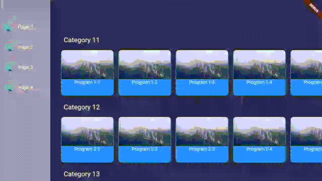

# flutter-tv-sample

This project is for testing D-pad control UI like leanback library of Android.

- Sidebar is toggled between 'title with icon' and 'icon only'.
- RecentFocusTraversalPolicy remembers latest focus of each rows and sidebar.

Flutter and the related logo are trademarks of Google LLC
